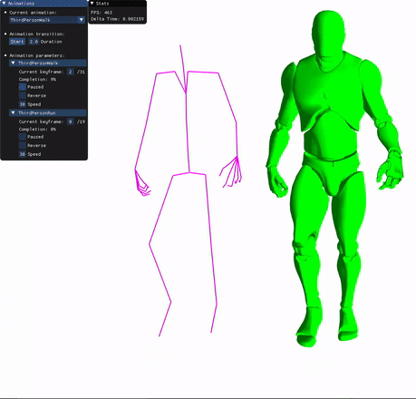
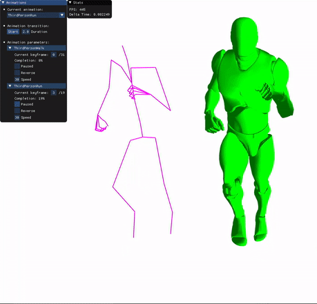

<div align="center">

# Animation Programming
</div>

**This project aims at understanding how animation works in video games.**<br/>
**The goal was to understand how animation works in video games and to learn the mathematical and structural challenges behind it.**

## Information
Project start : 09/12/2022 <br>
Project end : 02/01/2023 <br>
Version : 1.0 - GOLD <br>
Date last version : 02/01/2023

## Preview
  <br>
 

<br>

## Features

- Skeleton made up of bones stored in tree organization
- Animation:
    - Iteration through the animation keyframes
    - Interpolation between previous and current keyframes
- Mesh skinning (to apply skeleton transforms to the mesh)
- Animation transition

<br>

## Build and run
```
Visual Studio > Debug x86 > Local Windows Debugger
```
